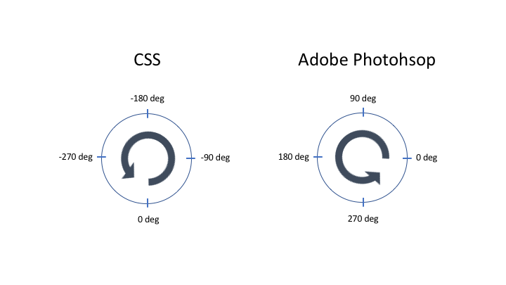
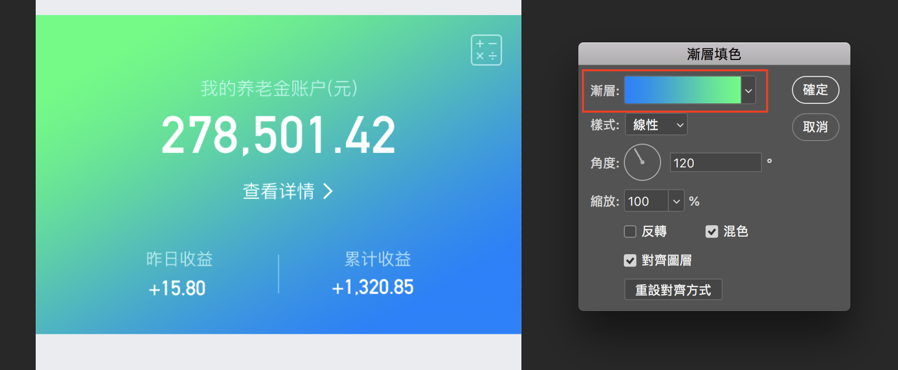
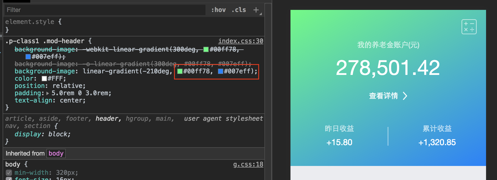

#  Background Gradient 背景漸層

Linear Gradient 線性漸層

## CSS 和 Photoshop 角度規則

CSS 角度 0 度起始位置在 6 點鐘位置，角度為正數時順時針方向旋轉。

Photoshop 角度 0 度起始位置在 3 點鐘位置，角度為正數時逆時針方向旋轉。

為了方便將 PS 漸層的角度換算成 CSS 的角度，可以將 CSS 漸層的角度用負數表示，負數表示為反方向，這樣 CSS 也成逆時針方向旋轉。

但是起始點一樣在 6 點鐘方向，這樣可以得出 CSS 和 PS 的角度相差 90 度。例如，如果在 PS 裡漸層角度設定為 90 度，換算成 CSS 的角度為 -(90+90) = -180 度

- Photoshop

  先決定填充顏色順序，漸層條由左至右為0% - 100%，再根據設定的角度填充顏色

  

- CSS

  先決定旋轉角度，角度後面設定的顏色，依順序填充

  

詳細文檔參考: <a href="https://www.w3schools.com/css/css3_gradients.asp" target="_blank">CSS Gradients - W3Schools</a>