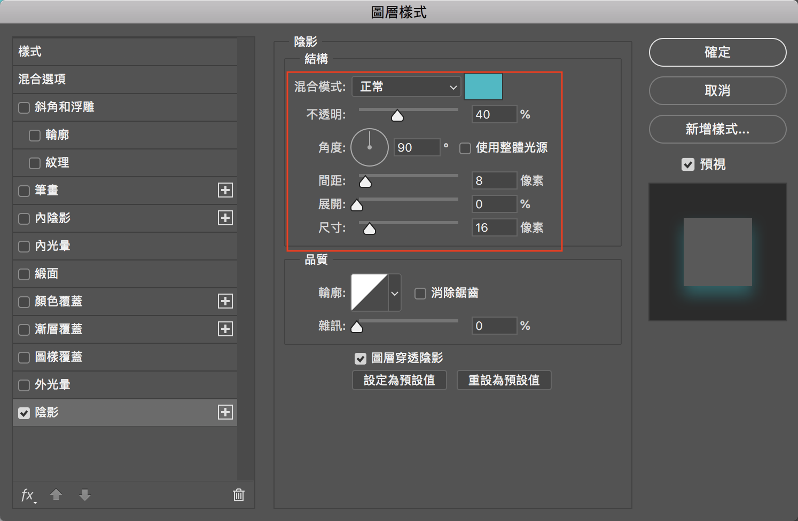
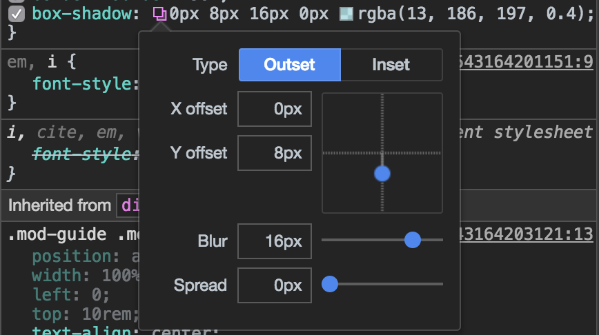

# Box-Shadow 與 PS 陰影

將 Photoshop 設計稿的陰影轉換成 CSS box-shadow，首先我們必須先了解 PS 和 CSS 陰影的表達式。

Photoshop 設定陰影的方式是顏色、透明度、角度、間距、展開、尺寸



但是 CSS box-shadow 的屬性則是 box-shadow: x-offset y-offset blur spread color inset;



## 計算座標點

我們需要將 PS 的角度和間距，轉換成水平座標 (x-offset) 和垂直座標 (y-offset)，有兩個步驟：

1. 將角度轉換弧度

  angle = (180 - angle) * Math.PI / 180;

2. 換算x, y座標點

  間距是距離 (distance) = 斜邊<br>
  水平的座標點 (x-offset) = 鄰邊<br>
  垂直的座標點 (y-offset) = 對邊<br>

<figure>
  <svg xmlns="http://www.w3.org/2000/svg" width="210" height="210">
    <line x1="20" x2="20" y1="10" y2="190" stroke="red" fill="transparent" stroke-width="3"></line>
    <line x1="20" x2="200" y1="190" y2="190" stroke="green" fill="transparent" stroke-width="3"></line>
    <line x1="200" x2="20" y1="190" y2="10" stroke="black" fill="transparent" stroke-width="3"></line>
    <path d="M 170 190 A 30 30, 0, 0, 1, 178.6 168.6" stroke="gray" fill="transparent" stroke-width="2"></path>
    <text x="75" y="208" fill="green">x-offset</text>
    <text x="-135" y="13" fill="red" transform="rotate(270)">y-offset</text>
    <text x="30" y="-11" fill="black" transform="translate(60,60) rotate(45) translate(0,0)">distance</text>
    <text x="176" y="114" fill="gray" transform="rotate(20)">angle</text>
  </svg>
</figure>

求 sin 的值是 sin(θ) = 對邊 / 斜邊，那可以反推，對邊 = sin(θ) * 斜邊<br>
同理，鄰邊 = cos(θ) * 斜邊


## 計算模糊和展開

在 PS 中的尺寸表示陰影的總長度，而展開表示一個純色的陰影百分比。在 CSS 展開的值是加上模糊的陰影。

CSS blur = PS 尺寸 - CSS spread <br>
CSS spread = PS 展開百分比 * PS 尺寸

## 實踐

**Solution 1** - PS to CSS box-shadow 線上產生器

http://www.psd-to-css-shadows.com/

**Solution 2** - 使用預編譯器

_mixin.scss

```scss
//--------------------------------
// Photoshop Drop Shadow
//--------------------------------
@mixin photoshop-drop-shadow ($angle: 0, $distance: 0, $spread: 0, $size: 0, $color: #000, $inner: false) {
  $angle: (180 - $angle) * pi() / 180; // convert to radians
  $h-shadow: round(cos($angle) * $distance);
  $v-shadow: round(sin($angle) * $distance);
  $css-spread: $size * $spread/100;
  $blur: ($size - $css-spread);
  $inset: if($inner != false, 'inset', '');
 
  @include box-shadow($h-shadow $v-shadow $blur $css-spread $color unquote($inset));
}
```

example.scss

```scss
.box {
  @include photoshop-drop-shadow(120, 10px, 50, 10px, rgba(0, 0, 0, 0.75));
}
```

參考資料:<br> 
[1] https://2012.heygrady.com/blog/2011/08/06/recreating-photoshop-drop-shadows-in-css3-and-compass/
[2] https://www.mathsisfun.com/sine-cosine-tangent.html
